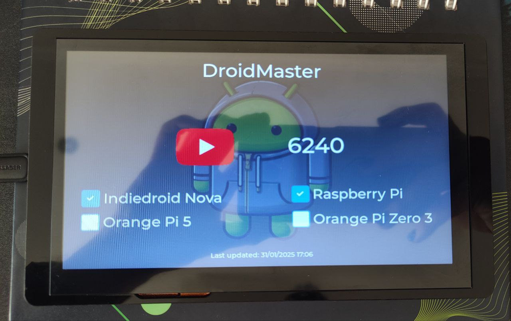

# 📊 DroidCrowPanel - YouTube & Network Status Dashboard  

🎥 **DroidCrowPanel** is a real-time **YouTube subscriber counter** and **network device monitor**, designed for the **CrowPanel 7.0** touchscreen display that has a **ESP32 Arduino integrated** by Elecrow. It tracks the latest subscriber count from YouTube and checks the availability of network devices on your local network.  

## 📸 Preview  
  
*(Replace this image with your own screenshot!)*  

## ✨ Features  
✅ **Live YouTube subscriber tracking** using the YouTube API  
✅ **Network device monitoring** via hostname/IP availability  
✅ **Real-time clock synchronization** via TimeAPI  
✅ **ESP32-powered**, optimized for low power    
✅ **Custom UI created with SquareLine Studio**  

## 🚀 How It Works  
- Connects to Wi-Fi and retrieves live **subscriber count** from YouTube  
- Pings local network devices (Raspberry Pi, Orange Pi, Indiedroid Nova, etc.) and updates their status dynamically  
- Displays the **last update time** and subscriber stats on the CrowPanel 7.0  

## 🖥️ About the Display  
This project is built for the **CrowPanel 7.0** by Elecrow

🔗 **You can buy it here for 25-30$:** [Elecrow CrowPanel 7.0](https://www.elecrow.com/esp32-display-7-inch-hmi-display-rgb-tft-lcd-touch-screen-support-lvgl.html)  

## 📂 Project Structure  
📦 DroidCrowPanel   
┣ 📂 code # Source code   
┣ 📂 images # Screenshots    
┣ 📜 README.md # This file   

## 🛠 Requirements  
- 🔹 **CrowPanel 7.0 (Elecrow)**  
- 🔹 **Wi-Fi connection**  
- 🔹 **YouTube API key**  

## 🎓 Learn More  
This project was inspired by and built using knowledge from these **YouTube tutorials**:  
[📺 Watch the full playlist here](https://www.youtube.com/watch?v=EYwEfrTWXyY&list=PLwh4PlcPx2GcKJ17Z_xcAxQoh-Tmms_X1)  

---

💡 *Contributions and feedback are welcome!* 🚀  
